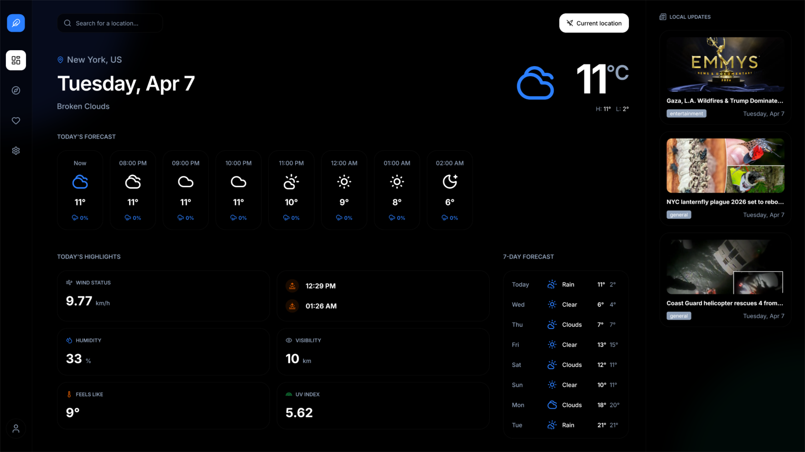

# React Weather App

Full‑stack weather and news dashboard built with React, TypeScript, TanStack Query, and an Express + Sequelize backend that integrates the OpenWeather API and TheNewsAPI. (1-Week Challenge)

---

## Overview

This project is a location‑aware weather application with a small news dashboard:

- **Frontend**: React + TypeScript + Vite single‑page app with client‑side routing, theming, and i18n.
- **Backend**: Express server with Sequelize ORM and SQLite for persistence.
- **External APIs**:
  - [OpenWeather One Call](https://openweathermap.org/api/one-call-api) for current, hourly, and daily forecasts and reverse geocoding.
  - [TheNewsAPI](https://www.thenewsapi.com/) for location‑related news headlines.
- **Data Layer**: [TanStack Query](https://tanstack.com/query/latest) for data fetching, caching, and request status management.

The app supports authentication, favorite locations, a settings screen, and a dashboard that combines weather and news into a single view.

---

## Tech Stack

### Frontend

- **React 19** with **TypeScript**
- **Vite 8** for bundling and dev server (`client/vite.config.ts`)
- **React Router 7** for routing (`client/src/router.tsx`)
- **TanStack React Query 5** + Devtools for server state management
- **i18next** + `react-i18next` for internationalization (`client/src/utils/i18n`)
- **Radix UI** primitives (e.g. tooltip provider) for accessible UI
- **Sass** for styling (`client/src/assets/styles/app.scss`)

### Backend

- **Node.js** + **Express 5** (`server/server.js`)
- **Sequelize 6** ORM
- **SQLite** database (`server/database.sqlite`)
- **JWT authentication** (`jsonwebtoken` + `bcryptjs`)
- **CORS** configured for local dev and a production domain
- **dotenv** for environment configuration (`server/.env`)

### Data & Infrastructure

- REST API between client (`fetchApi` helper) and server
- Local SQLite file for persistent data (users and favorite locations)
- Environment‑based configuration for API keys and secrets

### Tooling & DX

- **npm workspaces** (`client`, `server`) configured in the root `package.json`
- **npm-run-all** for running client and server in parallel (`npm run all`)
- **ESLint** + TypeScript configuration for the client
- **SVGO** + custom icon script (`client/src/scripts/icons.ts`)

---

## Features

### Weather & Location

- **Current weather and forecast** using OpenWeather One Call API.
- **Location detection** via the browser Geolocation API with a sensible default fallback (`useCurrentLocationWeather`).
- **Location search** powered by OpenWeather geocoding (`getCoordsByName` controller and `useLocationByNameQuery` hook).
- **Typed weather models** in `client/src/types` for safer UI rendering.

### News Integration

- **Location‑aware news** via TheNewsAPI (`NewsController.js` and `useNewsQuery`).
- Headlines filtered and limited for a compact weather‑plus‑news dashboard.

### Authentication & Favorites

- **JWT‑based authentication** with register/login endpoints (`UserController.js`, `User` model, `auth` middleware).
- **Protected routes** implemented via a `withAuth` HOC in `router.tsx` (e.g. the `/favorites` page).
- **Favorite locations** persisted in SQLite via Sequelize (`FavoriteLocation` model and `FavoritesController.js`).
- Favorites are integrated into the React app via `UserContext` and `useFavoriteLocationQuery`.

### Settings, Theming & UX

- **Settings page** for user preferences (e.g. theme & language).
- **Light / dark / system theme** support, persisted in `localStorage` and cookies via `useAppearance` and `initializeTheme`.
- **Skeleton loading states** and optimistic UI patterns implemented with TanStack Query.
- **Internationalization** hook‑up via i18next for a foundation of multi‑language support.

---

## Architecture

### High‑Level

The repo is structured as a small monorepo:

- Root project (`react-weather`)
  - `client/` – React + Vite frontend
  - `server/` – Express + Sequelize backend

The **client** talks only to the **backend** via a REST API. The **backend** then:

- Pulls weather and geocoding data from OpenWeather.
- Pulls news from TheNewsAPI.
- Persists users and favorite locations in SQLite.

### Frontend Architecture

Key files:

- `client/src/app.tsx`
  - Bootstraps React, wraps the app with:
    - `QueryClientProvider` + `ReactQueryDevtools` (TanStack Query)
    - `TooltipProvider` (Radix UI)
    - `LocationContextProvider`
    - `UserContextProvider`
  - Initializes the theme via `initializeTheme()`.

- `client/src/router.tsx`
  - Defines routes with `createBrowserRouter`:
    - `/auth` → `AuthLayout` + `Auth` page
    - `/` → `AppLayout` with nested pages:
      - `Dashboard` (default)
      - `Settings`
      - `Favorites` (wrapped in `withAuth` and only available to authenticated users)

- `client/src/context/user-context.tsx`
  - Centralizes auth state (user + token), favorites, and operations:
    - `login`, `register`, `logout`
    - `addFavorite`, `removeFavorite`
  - Leverages TanStack Query (`useUserQuery`, `useFavoriteLocationQuery`) for server data.

- `client/src/context/location-context.tsx`
  - Stores the currently active location and whether it came from search or current geolocation.

- `client/src/hooks/*.ts(x)`
  - `useCurrentLocationWeather` – handles geolocation, fallback coordinates, and weather fetching.
  - `useWeatherByCoordsQuery`, `useLocationByNameQuery`, `useNewsQuery`, `useFavoriteLocationQuery` – encapsulate REST calls in typed TanStack Query hooks.
  - `useAppearance` – manages theme selection and system preference integration.

- `client/src/utils/helpers.ts`
  - `fetchApi` – wrapper over `fetch` that uses `VITE_API_URL`, JSON headers, and attaches the JWT token (if present).
  - Date and time formatting helpers used throughout the UI.

### Backend Architecture

Key files:

- `server/server.js`
  - Sets up Express app, CORS, JSON body parsing.
  - Registers routes under `/api/*`:
    - Auth: `/api/auth/register`, `/api/auth/login`, `/api/auth/user`
    - Weather: `/api/weather`
    - News: `/api/news`
    - Location search: `/api/location`
    - Favorites: `/api/favorites`
  - Protects user and favorites routes with `authMiddleware`.
  - Initializes database (`initDatabase`) and seeds a test user (`seedUsers`).

- `server/Controller/*.js`
  - **UserController** – registration, login (with password validation), and current user endpoint.
  - **WeatherController** – proxies OpenWeather One Call API and adds reverse‑geocoded location metadata.
  - **NewsController** – queries TheNewsAPI for top headlines matching a search term.
  - **LocationController** – geocoding search using OpenWeather (city name → coordinates).
  - **FavoritesController** – CRUD for a user’s favorite locations.

- `server/Model/*.js`
  - **User** model (`User.js`):
    - Validates and stores hashed passwords (`bcryptjs`).
    - Provides instance methods for password validation and JWT token generation.
    - Includes a small seeder for a default test user.
  - **FavoriteLocation** model: stores `userId`, `lat`, `lon` for saved locations.
  - `Model/index.js` gathers models and exports `initDatabase` and `seedUsers`.

- `server/Middleware/auth.js`
  - Verifies JWT from `Authorization: Bearer <token>` header.
  - Attaches `req.userId` to the request on success and rejects unauthorized or invalid tokens.

---

## About the Project

- **Author**: Michele Savoca
- **Repository**: https://github.com/SavocaMichele/react-weather
- **Demo**: https://weather.msavoca.dev

This project was built with strict rules and a maximum timespan of 1 Week.

